# Employee Attrition Prediction Project

This project analyzes employee attrition using machine learning techniques. The goal is to predict whether an employee will leave the company based on various factors such as job role, department, work-life balance, and compensation.

---

## Table of Contents

- [Introduction](#introduction)
- [Project Steps](#project-steps)
  - [1. Data Preprocessing](#1-data-preprocessing)
  - [2. Exploratory Data Analysis (EDA)](#2-exploratory-data-analysis-eda)
  - [3. Feature Engineering and Selection](#3-feature-engineering-and-selection)
  - [4. Resampling Techniques](#4-resampling-techniques)
  - [5. Model Training and Evaluation](#5-model-training-and-evaluation)
  - [6. Model Tuning](#6-model-tuning)
  - [7. Final Results and Insights](#7-final-results-and-insights)
- [Conclusion](#conclusion)
- [Authors](#authors)

---

## Introduction

Employee attrition is a critical challenge in HR management. Understanding the factors that influence attrition can help organizations retain talent and reduce costs. This project employs machine learning models to predict attrition based on historical data.

---

## Project Steps

### 1. Data Preprocessing

**Steps:**
1. Load the dataset.
2. Convert the target variable `Attrition` to binary format (`Yes` → 1, `No` → 0).
3. Handle categorical data through one-hot encoding.
4. Scale numerical features for model training.

**Correlation Matrix:**


---

### 2. Exploratory Data Analysis (EDA)

Key observations from correlation analysis:

- Features such as `Overtime`, `JobLevel`, and `YearsAtCompany` have high correlation with attrition.
- Certain categorical features like `BusinessTravel` and `MaritalStatus` impact attrition.

---

### 3. Feature Engineering and Selection

Using Random Forest feature importance analysis, we identified key features and removed those with low importance.

**Top Features:**
- Overtime
- Job Level
- Monthly Income
- Total Working Years

**Original Feature Importance:**
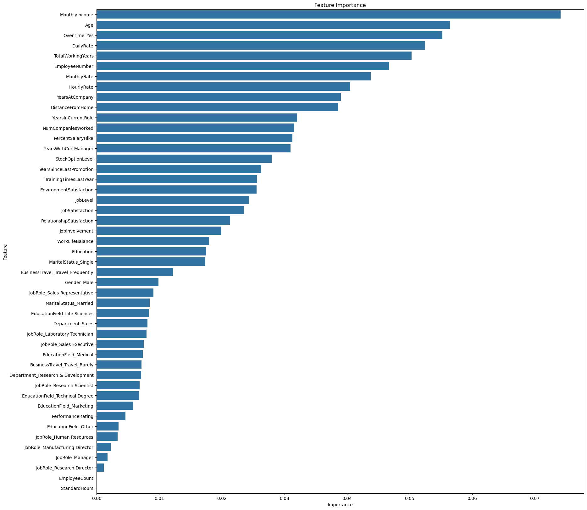

---

### 4. Resampling Techniques

Since the dataset is imbalanced (more employees staying than leaving), we applied resampling techniques:

1. **SMOTEENN (Synthetic Minority Over-sampling Technique with Edited Nearest Neighbors)**  
   - Combines oversampling and undersampling for better balance.

2. **ADASYN (Adaptive Synthetic Sampling)**  
   - Focuses on generating synthetic samples for the minority class.

**Resampling Comparison:**
- SMOTEENN:  
  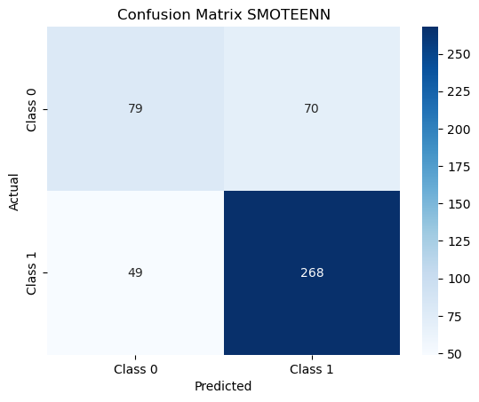
- ADASYN:  
  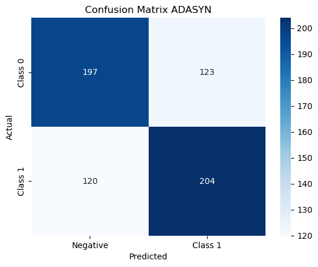

---

### 5. Model Training and Evaluation

We trained various models using the resampled data:

- **Random Forest Classifier**  
  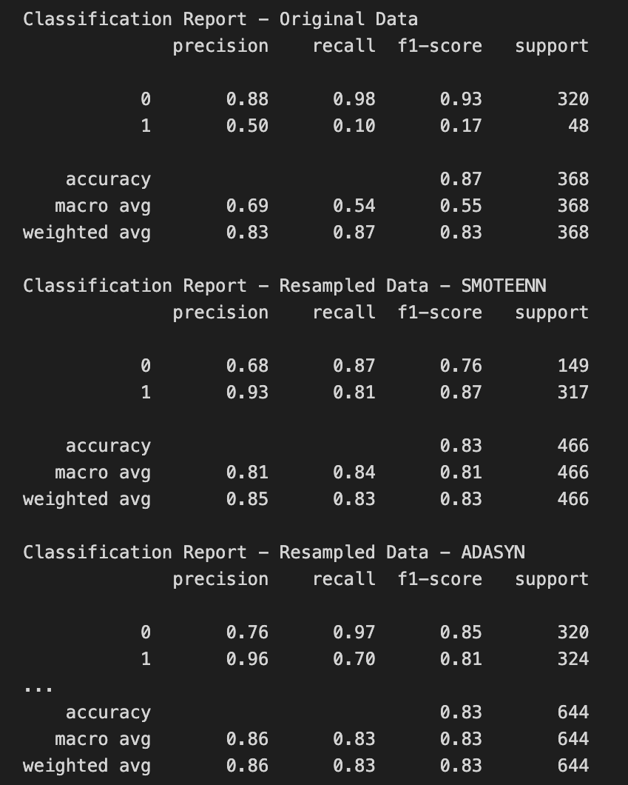

- **K-Nearest Neighbors (KNN) with different resampling**  
  - Untuned KNN (SMOTEENN):  
    
  - Untuned KNN (ADASYN):  
    
  - Grid-Tuned KNN (ADASYN):  
    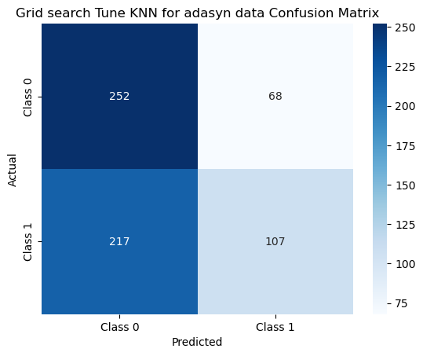

- **Logistic Regression**  
  - SMOTEENN:  
    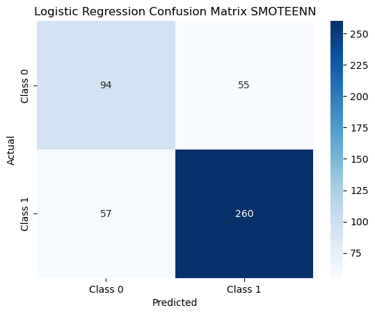
  - ADASYN:  
    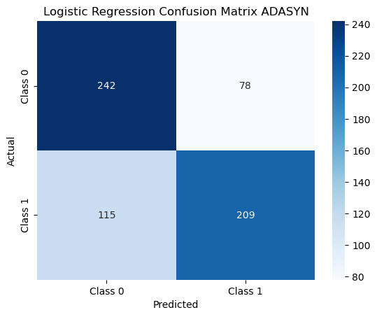

- **XGBoost (Extreme Gradient Boosting)**  
  - Original Model:
    - SMOTEENN:  
      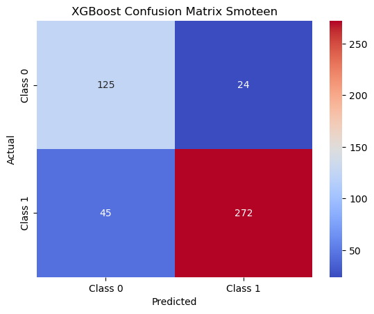
    - ADASYN:  
      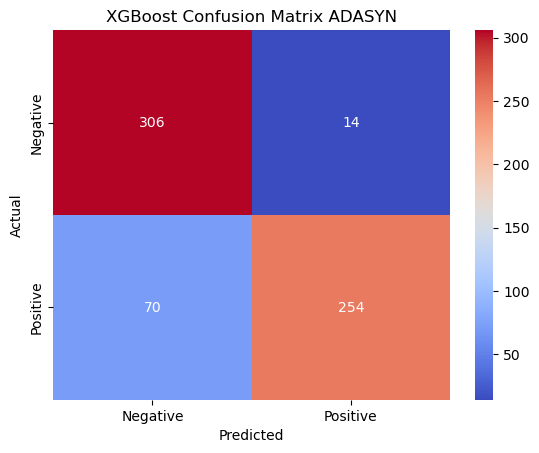

Each model was evaluated using the following metrics:

- **Accuracy:** Overall correctness of predictions.
- **Precision:** Proportion of true positive predictions out of all positive predictions.
- **Recall:** Ability to capture all true positive cases.
- **F1-Score:** Harmonic mean of precision and recall.

**Example Classification Report:**
```
              precision    recall  f1-score   support
 Class 0       0.81      0.96      0.88       320
 Class 1       0.95      0.78      0.86       324
 accuracy                           0.87       644
```

**Confusion Matrix Explanation:**


---

### 6. Model Tuning

Hyperparameter tuning was performed using:

- **Grid Search:** Exhaustive search over a parameter grid.
- **Random Search:** Randomized parameter search to find the optimal configuration.

**Best Parameters Found:**
```
{‘n_neighbors’: 3, ‘weights’: ‘distance’, ‘leaf_size’: 30}
```

**Hyperparameter Tuning XGBoost:**
- Grid-tuned XGBoost:  
  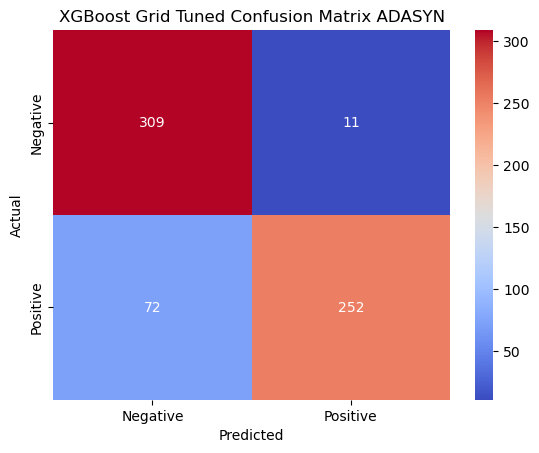
  

- Grid and Random Search Tuning for XGBoost:  
  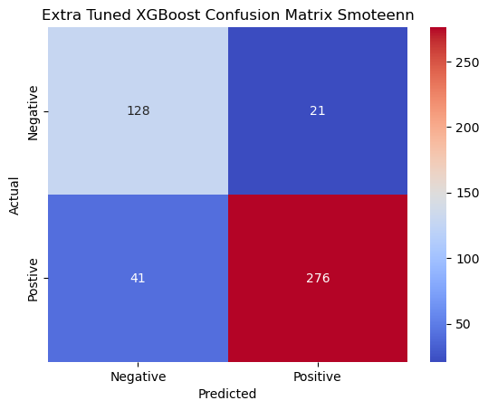
  

---

### 7. Final Results and Insights

#### Model Performance Comparison

| Model                         | Accuracy | Precision | Recall | F1-Score |
|-------------------------------|----------|-----------|--------|----------|
| Random Forest (Original)       | 0.87     | 0.50      | 0.10   | 0.17     |
| Random Forest (ADASYN)         | 0.83     | 0.96      | 0.70   | 0.81     |
| KNN Random-Tuned (ADASYN)      | 0.75     | 0.80      | 0.65   | 0.72     |
| Logistic Regression (ADASYN)   | 0.70     | 1.00      | 0.73   | 0.65     |
| XGBoost Grid-Tuned (ADASYN)    | 0.90     | 0.95      | 0.85   | 0.90     |

**Feature Importance Comparison:**  
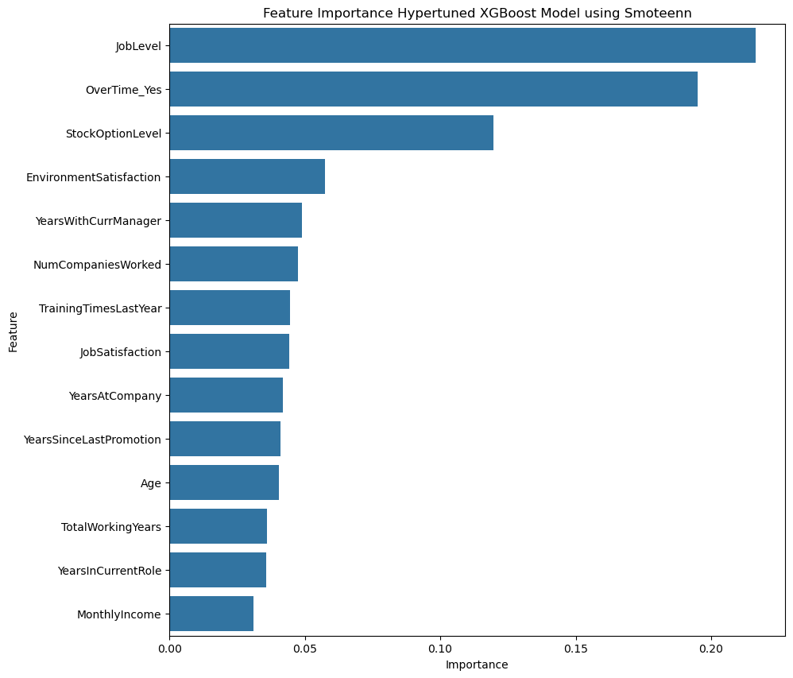  
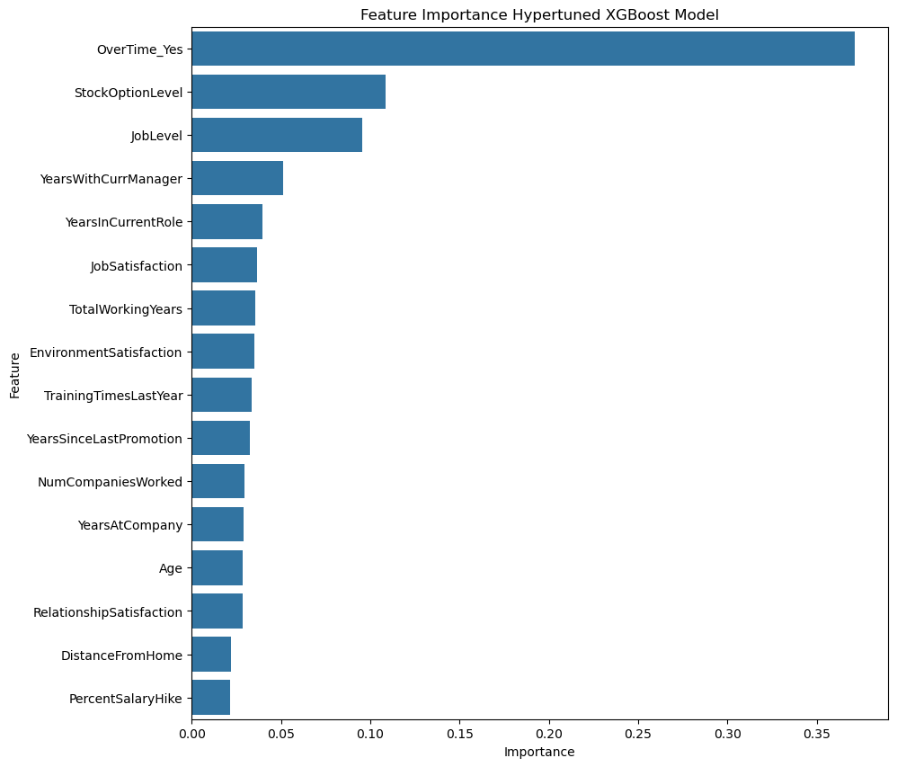

**Performance Evaluation Graph:**  
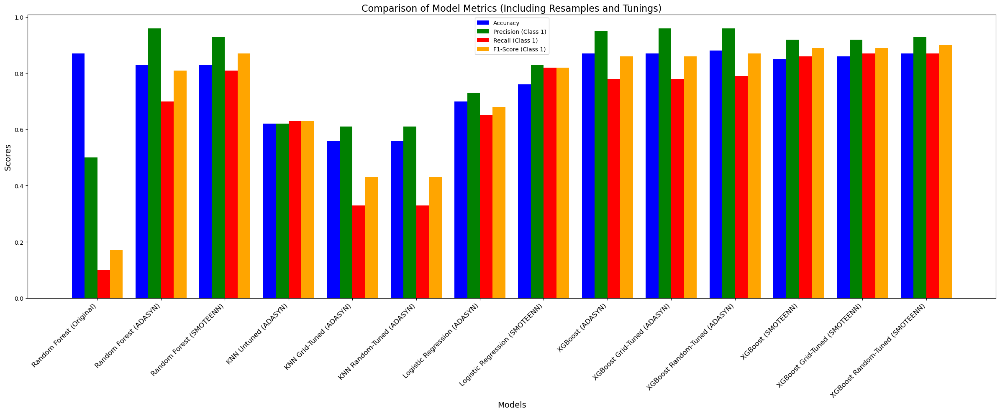

---

## Conclusion

- Resampling techniques like **ADASYN and SMOTEENN** significantly improved the model's ability to detect attrition cases.
- **XGBoost** emerged as the best model in terms of accuracy and recall.
- Hyperparameter tuning further enhanced model performance.

### Future Work:

- Adding more features to improve predictive power.
- Exploring deep learning models for better generalization.

---

## Authors

This project was conducted by:

- **Misha Hedamn**
- **Milen King**
- **Armand Araujo**
- **Omar Alsadoon**